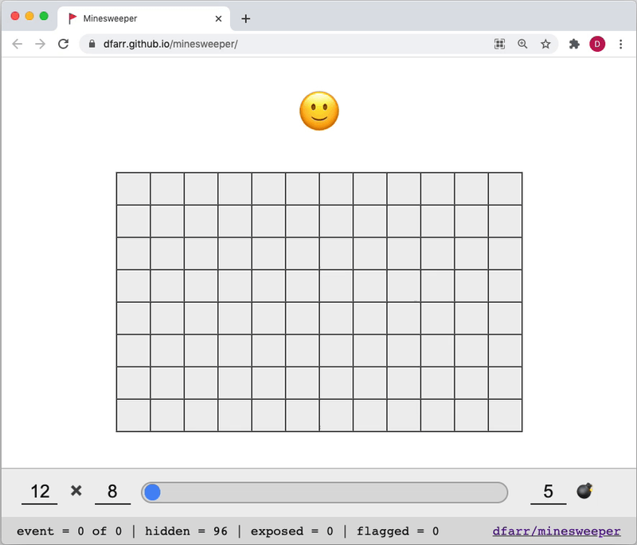

# minesweeper

An event sourced version of Minesweeper with a really cool replay slider, written in Elm.

- [Play the game](https://dfarr.github.io/minesweeper)
- [Read the blog](https://medium.com)

